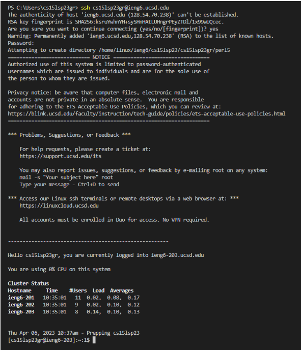

# Lab Report 1 | How to log into "ieng6"
## Installing VsCode
- 1) Go to this link [VsCode](https://code.visualstudio.com/) 
- 2) Download VsCode and it should look something like the image below 
- (it may look different depending on what setting and themes you have)

## Remotely Connecting
- 1) Download Git [GitBash](https://gitforwindows.org/)
- 2) Using VsCode, put Git as your default terminal and put in $ ssh cs15lsp23zz@ieng6.ucsd.edu
- 3) Then you want to reset your password for your specific cse15l account and put in the password for the account
- It should look somehting like this when you log in

## Trying Some Commands!
- 1) You can use commands of cd, ld, ~, etc.
- 2) Some of things I did is in the image below. Try some for yourself!

🤓 Wow you are a coding nerd 🤓
