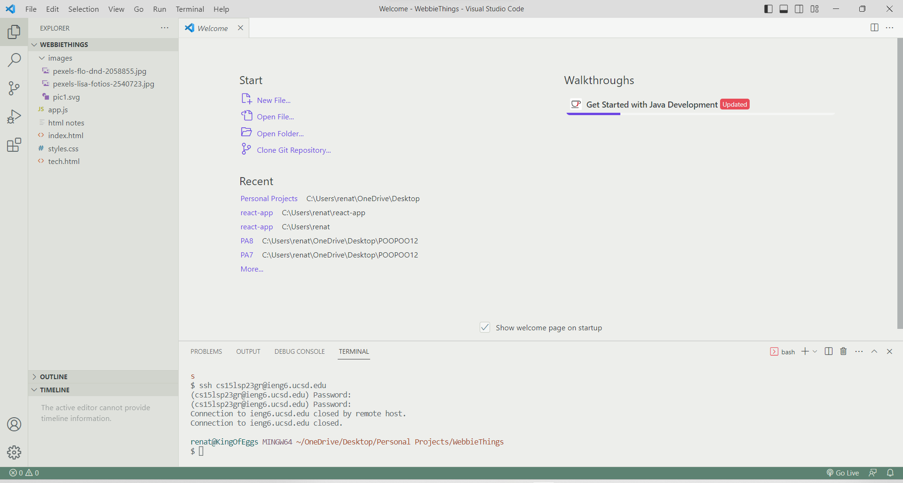

# Lab Report 1 | How to log into "ieng6"
## Installing VsCode
- 1) Go to this link [VsCode](https://code.visualstudio.com/) 
- 2) Download VsCode and it should look something like the image below 
- (it may look different depending on what setting and themes you have)

## Remotely Connecting
- 1) Download Git [GitBash](https://gitforwindows.org/)
- 2) Using VsCode, put Git as your default terminal and put in $ ssh cs15lsp23zz@ieng6.ucsd.edu
- 3) Then you want to reset your password for your specific cse15l account and put in the password for the account
- It should look somehting like this when you log in

## Trying Some Commands!
- 1) You can use commands of cd, ld, ~, etc.

cd <path> "Change Directory" | Will change the current directory to the directory stated. This command does return anything in particular but will open into the path inputed.

ls <path> "List" | returns the files and folders in the given path. 
 
~ | Is a shortcut to reference the home direcotry without typing the whole thing out. Useful if you wanted to search for items in the home direcotry or need to go directly back to it.

- 2) Some of things I did is in the image below. Try some for yourself!

  
ls -a | This combination of commands in particular will show the files and folders in the path given, but the "-a" will also show the hidden files in the path given
🤓 Wow you are a coding nerd 🤓
